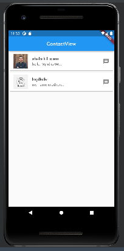
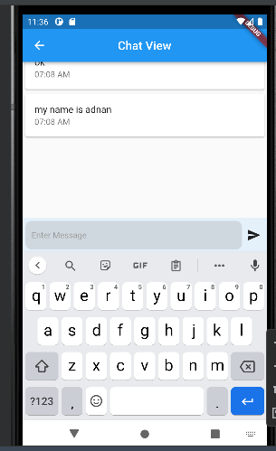

# ChatBox_app

Project Name : ChatBox App.
Dart Version : 2.19.6
Flutter Version : 3.7.11

## Getting Started

- State management >>  Getx
- flutter architecture >> Get CLI Format
  list of technologies and libraries used
    - http:

App Features 
   - login done 
   - contact list done  
   - message history done 
   - send message done  

A few resources to get :

- [Project APK ]()
- [Project Source Code]()
- [Project Documentation]()
- [Project Demo]()

# Screenshots

If you have any questions, please feel free to contact us.
Engr. Md.adnan Morshed
Software engineer
mail : adnanmorshed118@gmail.com
Mobile : 01831679008
